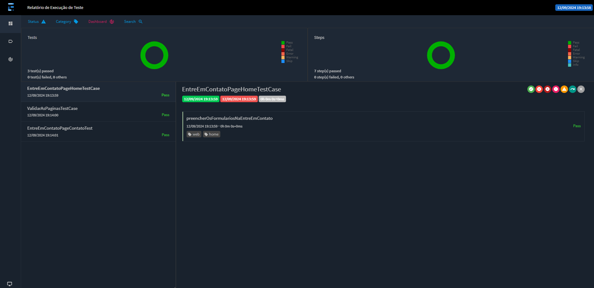

## Site Institucional DB

### [ABC Tecnhology](https://site-institucional-db-fork.vercel.app/)


#### O projeto é exclusivamente para [DBServer](https://db.tec.br/).
  
---  

:clipboard: - [Documents]([https://site-institucional-db-fork.vercel.app/](https://github.com/Fase02-db/site-institucional-db/tree/test/documents))
  
---  

### Ferramentas que foi ulitizado?

#### Construido com a estrutura:

:pushpin: [MAVEN](https://maven.apache.org/download.cgi),

:pushpin: [JAVA 17](https://www.oracle.com/java/technologies/javase/jdk17-archive-downloads.html)

#### Dependencias:
:pushpin: [TestNG](https://mvnrepository.com/artifact/org.testng/testng/7.10.2),

:pushpin: [Selenium Java](https://mvnrepository.com/artifact/org.seleniumhq.selenium/selenium-java/4.23.1),

:pushpin: [WebDriverManager](https://mvnrepository.com/artifact/io.github.bonigarcia/webdrivermanager/5.9.2),

:pushpin: [Extent Reports TestNG Adapter](https://mvnrepository.com/artifact/com.aventstack/extentreports-testng-adapter/1.0.3)
  
---  

### Baixando o projeto:

Para baixar o projeto, abrir o comando ou dentro IDE:
```bash  
git clone https://github.com/Fase02-db/site-institucional-db/tree/test
```  

#### Como executar?
Para executar na sua máquina local, o comando ou através de sua IDE:
```bash  
mvn clean install
```
```bash  
mvn test
```  
Para executar o teste, o navegador padrão Chrome será aberto automaticamente.

Alterado o navegador preferido para executar no Firefox ou Edge. 

O caminho para acessar as pastas dentro da IDE:
```  
src/main/java/br.com.db/utils/BaseTest  
```  
```java  
@BeforeMethod DriverFactory.createInstance(BrowserEnum.CHROME);  
```  
Remova `Chrome` de `BrowserEnum.Chrome`,  apertar CTRL + ESPAÇO, tem a opção escolher entre Firefox ou Edge.
  
---  
#### Report:
Após a execução do projeto, para visualizar o relatório:   
Abra a pasta de report e selecione o arquivo report.html. Clique com o botão direito do mouse, vá em "Open in", depois "Browser" e escolha o navegador da sua preferência.

#### Screenshot:


---
:robot::coffee:
